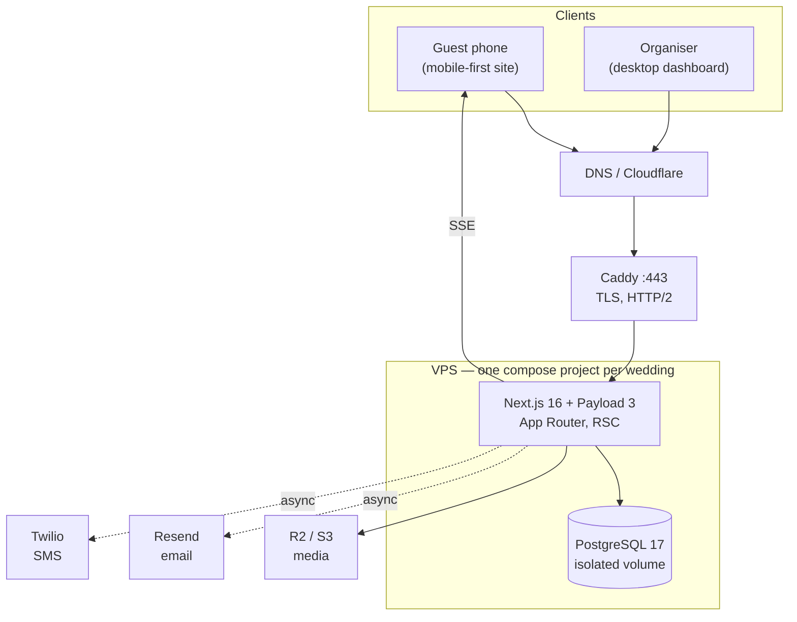

# Architecture

## 1. Shape of the system

One wedding is served by one deployment: a single Next.js process that embeds Payload CMS,
talking to a dedicated PostgreSQL database. There is no separate API service, no message
broker, and no cache tier. This is deliberate — see ADR-001 and ADR-006.



## 2. Application boundaries

The rule that keeps this maintainable: **UI never talks to the database, and domain logic
never imports React.**

```
src/
  app/
    (guest)/            Public wedding site + invitation pages. Mobile-first.
    (organiser)/        Authenticated dashboard. Desktop/tablet-first.
    (payload)/admin/    Payload Admin — platform maintenance, admin role only.
    api/                Route handlers (RSVP submission, SSE stream, exports).
  collections/          Payload collection configs = schema source of truth.
  globals/              WeddingSettings, PhotoQueueState.
  domain/               Business logic. No React, no Next imports. Unit-tested.
    wedding/            getWeddingSettings(), feature flags.
    invitations/        Token generation, hashing, lookup, rotation.
    rsvp/               Submission, validation, status derivation.
    seating/            Assignment rules, capacity, unassigned queries.
    photo-queue/        State machine and transitions.
    notifications/      Provider interface + dispatch/dedupe.
  lib/
    realtime/           RealtimeTransport abstraction (SSE implementation).
    auth/               Session helpers, requireOrganiser().
    validation/         Zod schemas shared by client and server.
  components/
    guest/  organiser/  ui/     (ui/ = shadcn primitives)
```

Dependency direction is one-way: `app → components → domain → payload`. `domain` may not
import from `app` or `components`. This is what makes the domain unit-testable without a
browser or a running Next server, and it is what a future SaaS migration would reuse.

### Why the domain layer exists at all

Without it, "is this guest allowed to pick the children's menu?" ends up written three
times — in the RSVP form, in the organiser editor, and in the caterer export — and they
drift. Rules live once, in `domain/`, and every surface calls them.

## 3. Rendering strategy

- **Server Components by default.** The guest site and dashboard read via Payload's
  **Local API**, which runs in-process — no HTTP round trip to our own API.
- **Client Components only where interaction demands it**: the RSVP form, the seating
  planner (dnd-kit), the wedding-day controller, and the live photo queue.
- **Route handlers** are used for mutations from client components, SSE, and file exports.

Guest pages are dynamic but cheap; wedding content changes rarely and is cached with
tag-based revalidation invalidated by Payload hooks on `WeddingSettings` and content
collections.

## 4. Authentication and authorisation

Payload's built-in auth for organisers (HTTP-only cookie, JWT). Guests never authenticate;
their invitation token _is_ their capability.

Authorisation is enforced in three places, deliberately redundant:

1. Payload collection `access` functions — the backstop that covers the Local API,
   REST, GraphQL, and Admin at once.
2. `requireOrganiser()` in organiser layouts and route handlers.
3. Middleware for coarse route protection.

The guest surface never receives an authenticated Payload user, so a guest request cannot
reach organiser data even if a query were written carelessly. Detail in `docs/SECURITY.md`.

## 5. Real-time (photo queue)

```mermaid
sequenceDiagram
    participant O as Organiser controller
    participant API as Route handler
    participant DB as PostgreSQL
    participant B as In-process broadcaster
    participant G as Guest phone (SSE)

    O->>API: POST /api/photo-queue/next
    API->>DB: transition state (transaction)
    DB-->>API: committed
    API->>B: publish(queue.updated)
    B-->>G: event: queue.updated
    G->>G: re-render NOW / UP NEXT / YOUR GROUP
    Note over G: on disconnect, EventSource retries;<br/>after N failures, fall back to polling
```

The broadcaster is in-process (a subscriber registry). That is sound because one wedding
runs one container. It is hidden behind `RealtimeTransport` so replacing it with Redis
Pub/Sub or Ably is a single-file change if replicas ever become necessary (ADR-006).

Events carry the whole queue plus a monotonic revision number, and a client applies one
only when the revision is newer than what it holds. Nothing is ever replayed: a phone that
reconnects is simply sent the current state as its first event, which is what makes
recovery from a dropped connection identical to a first load. The server therefore keeps
no per-client delivery state at all.

The same counter guards writes. A controller sends the revision it was displaying, and a
press from a screen that has fallen behind is refused rather than applied on top — two
organisers both pressing _Call next_ would otherwise skip a group entirely (ADR-020).

If the stream cannot be re-established after three attempts, the client falls back to
polling the same state as JSON and keeps retrying the stream in the background. Venue
wifi is the expected condition, not the exception.

## 6. Notifications

Interactive requests never block on Resend or Twilio. An organiser action writes one row
per message and returns; delivery runs in `after()`, once the response has already gone
out. Anything still queued is picked up by a single in-process timer, and
`POST /api/notifications/dispatch` forces a pass by hand or from an external scheduler
(ADR-025).

Deduplication is a **unique `dedupeKey` in Postgres**, so two concurrent dispatchers
cannot double-send — the second insert simply fails (ADR-023).

Retries are deliberately impatient: four attempts across about twenty seconds, and every
message carries a maximum age after which it is abandoned. A wedding-day alert delivered
late is a wrong instruction rather than a late success (ADR-024).

`NotificationProvider` has a console implementation used in development and CI, so tests
never make network calls or incur cost.

## 7. Storage

Media goes through Payload's upload handling. Development writes to local disk; production
uses S3-compatible storage (Cloudflare R2) selected by environment variable. Uploads are
validated on MIME type and size, and served with restrictive content headers.

## 8. Verified technology choices

Versions confirmed against the npm registry on 2026-08-29, not copied from the brief.

| Concern                | Choice                                    | Note                                      |
| ---------------------- | ----------------------------------------- | ----------------------------------------- |
| Framework              | Next.js 16.3                              | Payload 3.88 declares `next >=16.2.6 <17` |
| Runtime                | Node 24 LTS                               | Next requires `>=20.9`                    |
| UI                     | React 19.2                                |                                           |
| CMS/backend            | Payload 3.88                              | Payload 4 is `canary` only — not adopted  |
| Database               | PostgreSQL 17 + `@payloadcms/db-postgres` | Drizzle underneath                        |
| Language               | TypeScript 5.9.3                          | **Not 7.0** — see ADR-008                 |
| Styling                | Tailwind CSS 4                            | CSS-first config                          |
| Components             | shadcn/ui + Lucide                        |                                           |
| Drag & drop            | dnd-kit 6.3                               | with keyboard-accessible fallback         |
| Forms                  | React Hook Form 7 + Zod 4                 | Zod schemas shared client/server          |
| Unit/integration tests | Vitest 4 + React Testing Library          |                                           |
| E2E                    | Playwright 1.62                           |                                           |
| Package manager        | pnpm 10                                   |                                           |
| Infrastructure         | Docker Compose, Caddy                     | no Kubernetes, no Redis                   |

**Server-side validation is mandatory regardless of client validation.** Zod schemas are
defined in `lib/validation/` and executed on the server; the client merely reuses them for
fast feedback.

## 9. Deployment model

Each wedding is an independent Docker Compose project with its own database, volumes,
secrets, and domain. Several may share a VPS; none share state. See
`docs/CLIENT_DEPLOYMENT.md`.

The image is multi-stage and ships Next's standalone output: the runtime layer contains
the built application, five runtime packages, and no package manager, and it runs as an
unprivileged user. That is also why the Payload CLI is not in it — migrations run from a
second target built from the same Dockerfile, once per deploy, and exit (ADR-028).

Only Caddy publishes ports. Neither the application nor Postgres does, so TLS cannot be
bypassed by reaching the origin directly and one wedding's database is not addressable
from another's project on the same host.

## 10. Observability

One JSON object per line, written by exactly one module. Every context object and every
message passes through a redaction layer first, which strips invitation tokens, contact
details, and special-category fields whether they arrive as a field, inside a URL, or
inside an error message (ADR-026). Nothing else in the application writes to the console,
which is what makes that guarantee hold.

`/api/health` reports **readiness, not connectivity**: it checks that the schema exists as
well as that the database answers. A deployment whose migrations have not run connects
perfectly well and then serves 500s on every page, and a bare `SELECT 1` probe would call
that healthy.

Error reporting goes through `reportError`, which always logs and forwards to an optional
reporter. Nothing is registered by default: sending a third party fragments of a real
guest list is the couple's decision and belongs in their privacy notice (ADR-027).
