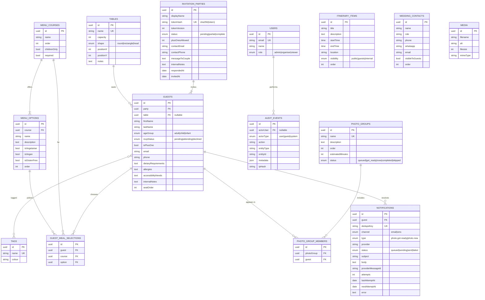

# Data Model

Source of truth is the Payload collection configuration in `src/collections/`. This
document explains intent, relationships, and the constraints that matter. Update it when
collections change.

Conventions: Payload owns `id`, `createdAt`, `updatedAt` on every collection. Payload's
Postgres adapter stores `hasMany` relationships and array fields in generated join
tables; those are noted where they matter for querying.

There is no `weddingId` anywhere. One deployment serves one wedding (ADR-001).

---

## ER diagram

Globals (single-row, not shown above): `WeddingSettings`, `PhotoQueueState`.

---

## Entities

### Users

Payload auth collection. Organiser accounts only — guests never have accounts.

`role` is `admin | organiser | viewer`.

- `admin` — full access, including Payload Admin at `/admin`.
- `organiser` — full access to the organiser dashboard; no Payload Admin.
- `viewer` — read-only. Intended for a wedding planner or family helper.

Access control is enforced server-side in every collection's `access` functions, not in
the UI (see `docs/SECURITY.md`).

### WeddingSettings (Global)

The single configuration record. Couple names, wedding date and timezone, ceremony and
reception details, venues and map links, RSVP deadline, dress code, welcome text,
accommodation, travel, parking, FAQs, hero imagery, theme, and the feature flags.

**Read exclusively through `getWeddingSettings()`** (ADR-001). No component imports this
global directly.

### InvitationParties

People invited together. The unit that receives an invitation link and submits an RSVP.

- `tokenHash` — SHA-256 of the invitation token, **unique index**. The raw token is
  returned exactly once, when generated or rotated, and never stored (ADR-005).
- `tokenVersion` — incremented on rotation so old links can be reported as expired rather
  than merely "not found".
- `status` — `pending` until anyone responds, `partial` while some guests are still
  `pending`, `complete` when every guest has responded. Maintained by a hook so the
  dashboard can filter without aggregating.
- `messageToCouple` — belongs to the party, not the individual guest.

### Guests

An individual person. Always belongs to exactly one party (`ON DELETE CASCADE` — deleting
a party removes its guests).

- `rsvpStatus` is the single source of current truth (ADR-009).
- `table` is a nullable FK. `NULL` means unassigned, which is exactly the
  "unassigned guests" query the seating planner needs.
- `isPlusOne` marks a placeholder seat the inviting guest may name later.
- `smsConsent` / `smsConsentAt` record explicit opt-in for text messages, stamped when it
  is given and cleared when withdrawn. A phone number is never treated as permission, and
  consent is never inherited from the party.
- `ageGroup` drives children's menu eligibility and adult/child counts for the caterer.
- PII (`email`, `phone`, dietary, allergies, accessibility) is minimised and never logged.

### Tags

Free-form organiser labels ("bride's side", "evening only"). Many-to-many with guests.

### MenuCourses / MenuOptions / GuestMealSelections

Courses are ordered (Starter, Main, Dessert, Children's, Drinks). `required` drives the
"missing selection" report. `childrenOnly` restricts a course to `ageGroup = child`.

A selection is unique per `(guest, course)` — a guest picks at most one option per course.
Enforced with a unique constraint, because the RSVP form and the organiser dashboard can
both write.

Supports the menu models in the brief: a fixed menu is a course with one option;
"no advance selection" is the feature flag turned off.

### Tables / seating

`Guest.table` is the assignment. `capacity` is advisory — the planner **warns** on
over-capacity rather than rejecting, because organisers legitimately squeeze in a chair.
`positionX/Y` store planner layout, not a floor plan (no CAD editor in MVP).

### ItineraryItems

Ordered timeline. `visibility` separates the guest-facing schedule from internal
supplier timings.

### PhotoGroups / PhotoGroupMembers / PhotoQueueState

A guest may belong to several groups. Membership is a Payload `hasMany` relationship, so
the join table is `photo_groups_rels` rather than a hand-written collection; the ER
diagram keeps the logical name. `Guests.beforeDelete` removes a deleted guest from every
group, because the join would otherwise keep counting them.

Statuses are `queued → get_ready → now → completed`, with `skipped` as an escape hatch.
Transitions are enforced in `src/domain/photo-queue/`, not the UI, and are directly
unit-tested. `get_ready` is **derived, never authoritative**: the projection normalises
the queue on read as well as on write, so exactly one group is `now` and the next pending
group — and only that one — is `get_ready`, whatever is in the table.

There is no `calledAt`/`completedAt` per group. Nothing in the MVP reads them, and the
audit log already records every queue action with the organiser who pressed it and when,
which is the real "what happened when" record.

`PhotoQueueState` (global) holds a monotonic `revision` rather than a pointer to the
current group — the group statuses already say where the run is. Every change increments
it; every event carries it; a controller sends the revision it was showing and is refused
if it has fallen behind (ADR-020).

"How far away is my group?" is computed from `order` relative to the current group.

### Notifications

One row per delivery attempt chain. `dedupeKey` is **unique** — this is the deduplication
mechanism the brief requires, enforced by the database rather than by application logic,
so concurrent workers cannot double-send (ADR-023).

Holds **no recipient address**. The address is read from the guest at send time, so a
corrected email is used rather than a stale copy and there is one fewer place holding
contact details. The rendered `subject`/`body` _are_ stored — they have to be, to be sent,
and storing them keeps the dispatcher generic: it never has to know what a photo group is.
Because the body contains the guest's name, deleting a guest deletes their notifications.

`nextAttemptAt` drives both the retry backoff and the "is anything waiting" query. A row
with no `nextAttemptAt` will not be tried again.

### AuditEvents

Append-only. Records who changed what. `ipHash` is a salted hash, never a raw IP.
Provides RSVP history (ADR-009) without a second source of current state.

---

## Indexes and constraints

| Purpose                    | Definition                                  |
| -------------------------- | ------------------------------------------- |
| Invitation lookup          | `UNIQUE` on `invitation_parties.token_hash` |
| Guest listing / party page | index on `guests.party`                     |
| RSVP dashboard counts      | index on `guests.rsvp_status`               |
| Unassigned + table views   | index on `guests.table`                     |
| One choice per course      | `UNIQUE (guest, course)` on meal selections |
| Notification dedupe        | `UNIQUE` on `notifications.dedupe_key`      |
| Due notifications          | index on `notifications.next_attempt_at`    |
| Notification status counts | index on `notifications.status`             |
| SMS eligibility            | index on `guests.sms_consent`               |
| Queue ordering             | index on `photo_groups.order`               |
| Queue status filters       | index on `photo_groups.status`              |
| Unambiguous call-outs      | `UNIQUE` on `photo_groups.name`             |
| Table naming               | `UNIQUE` on `tables.name`                   |
| Organiser login            | `UNIQUE` on `users.email` (Payload default) |

## Transactions

RSVP submission writes guest statuses, meal selections, the party status, and an audit
event. It runs in a single transaction via Payload's `req.transactionID` so a partial
household response can never be persisted.
